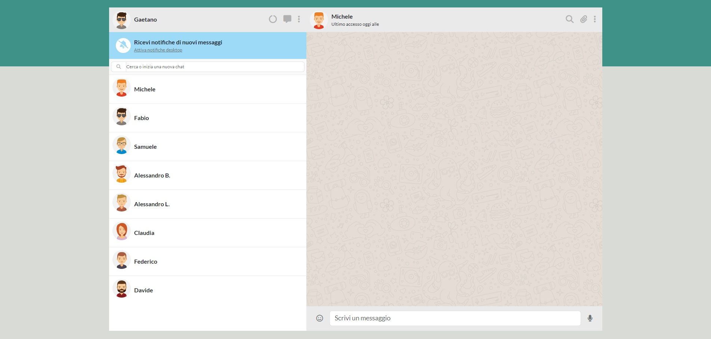

# Boolzapp

### _Whatsapp Web riprodotto con una web-app chiamata Boolzapp_

### Milestone 1 Completata

> Replica della grafica con la possibilità di avere messaggi scritti dall’utente (verdi) e dall’interlocutore (bianco) assegnando due classi CSS diverse.

> Visualizzazione dinamica della lista contatti: tramite la direttiva v-for, visualizzare nome e immagine di ogni contatto

